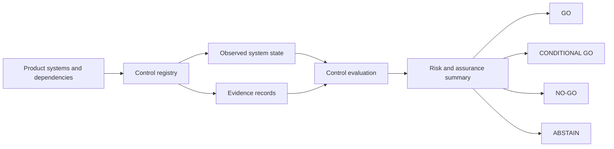

# Institutional Digital Asset Assurance & Go-Live Control Plane

> Executable assurance framework for evaluating institutional digital-asset controls and translating evidence into explicit go-live decisions.

**[Open Live Assurance Console](https://vishnugovind10.github.io/institutional-digital-asset-assurance/)** · Reference implementation / architecture demonstration using synthetic data.

## Why this exists

Institutional digital-asset products depend on smart contracts, custody, tokenisation platforms, blockchain infrastructure, settlement systems, NAV and investment data, governance processes, and third-party providers. A policy statement alone does not show that a control operated as intended. This project expresses selected requirements as executable controls, evaluates them against declared system state and dated evidence, and turns the results into a transparent go-live recommendation.

The implementation is an assessment synthesis layer. It does not replace the underlying settlement state machine, tokenisation stack, evidence verifier, or investment analysis interface.

## What it demonstrates

- A small control registry with owners, domains, severity, blocking status, state requirements, evidence freshness and remediation.
- Explicit `PASS`, `PARTIAL`, `FAIL` and `ABSTAIN` results.
- Evidence provenance with source, observed date, status and stable reference identifier.
- Divergent state handling that preserves uncertainty instead of choosing a convenient source.
- Deterministic scenarios that produce `GO`, `CONDITIONAL GO`, `NO-GO` and `ABSTAIN`.
- A static, no-login web console with executive summary, control matrix, evidence explorer, architecture view and decision trace.

## Architecture



The Python engine is the decision source. The browser console reads JSON reports generated by that same engine from the YAML control registry and scenario files. The static site does not make network calls other than loading its own report files and presentation fonts.

## Decision model

| Outcome | Rule |
| --- | --- |
| **GO** | All in-scope controls pass with current evidence and consistent declared state. |
| **CONDITIONAL GO** | No blocking control fails; non-blocking issues produce explicit owner-linked remediation conditions. |
| **NO-GO** | A blocking control fails based on the declared state or evidence. |
| **ABSTAIN** | Critical evidence is missing or stale, or material system state is declared inconsistent. The engine does not infer effectiveness. |

Decision precedence is `NO-GO` for a demonstrated blocking failure, then `ABSTAIN` for unresolved material uncertainty, then `CONDITIONAL GO` for remaining remediable findings, otherwise `GO`. This is an illustrative policy and is not a universal institutional standard.

## Demonstration scenarios

| Scenario | Injected condition | Result |
| --- | --- | --- |
| `go` | Current evidence and expected state across the registry | GO |
| `conditional_go` | Partial non-blocking change approval evidence | CONDITIONAL GO |
| `no_go` | Single privileged administrator controls contract upgrades | NO-GO |
| `abstain` | Custody attestation is 47 days old against a 30-day freshness window | ABSTAIN |

All scenario records are synthetic. Identifiers such as `sha256:demo-cu001` are illustrative references, not hashes of external evidence artifacts.

## Design Lineage

This repository synthesizes design patterns developed across the author's previous open-source work into an institutional assurance and go-live decision workflow. It links the patterns; it does not copy or bundle the prior systems.

```text
Fund / investment analysis                 UV Terminal
              │
              ▼
Institutional digital-asset infrastructure
  ├─ institutional-digital-collateral-stack
  └─ tokenize-stack
              │
              ▼
Settlement state assurance
  └─ institutional-settlement-state-machine
              │
              ▼
Executable controls
  └─ control-probe
              │
              ▼
Evidence verification
  ├─ liquid-proofpack
  └─ liquid-witness
              │
              ▼
Liquidity and stress modelling
  └─ temporal-liquidity-risk
              │
              ▼
NEW SYNTHESIS: controls · system state · evidence · risk · decision
```

- [UV Terminal](https://uv-terminal.vercel.app/) presents an illustrative investment-committee benchmark and decision workflow. This project uses it as adjacent fund/investment-analysis lineage; it is not a code dependency.
- [institutional-digital-collateral-stack](https://github.com/vishnugovind10/institutional-digital-collateral-stack) models executable settlement controls across eligibility, valuation, custody authorization, DvP, liquidity and reconciliation.
- [tokenize-stack](https://github.com/vishnugovind10/tokenize-stack) demonstrates a local tokenisation reference stack with custody policy enforcement, DvP settlement, reconciliation and audit trail.
- [institutional-settlement-state-machine](https://github.com/vishnugovind10/institutional-settlement-state-machine) models settlement as coordinated state transitions and keeps operational state, evidence, finality, reconciliation and legal status distinct.
- [control-probe](https://github.com/vishnugovind10/control-probe) demonstrates executable control evidence for digital-asset infrastructure under stress.
- [liquid-proofpack](https://github.com/vishnugovind10/liquid-proofpack) defines scoped, verifiable evidence bundles; [liquid-witness](https://github.com/vishnugovind10/liquid-witness) separates verdict logic, evidence serialization and live-backend boundaries.
- [temporal-liquidity-risk](https://github.com/vishnugovind10/temporal-liquidity-risk) demonstrates time-dependent liquidity shortfalls in tokenised settlement systems.

Descriptions summarize the linked project READMEs and repository metadata checked during this build. These projects are lineage references, not endorsements or evidence of institutional deployment.

## Repository structure

```text
src/assurance/       Typed-by-contract evaluation and command-line interface
scenarios/           Shared control registry and four synthetic YAML assessments
tests/               Decision, freshness, evidence and scenario regression tests
site/                Static public console and engine-generated report JSON
scripts/             Static report generation
docs/                Decision semantics and evidence boundaries
.github/workflows/   CI and GitHub Pages deployment
```

## Run locally

Requires Python 3.11 or later.

```bash
python -m venv .venv
# Windows PowerShell: .venv\Scripts\Activate.ps1
# macOS/Linux: source .venv/bin/activate
python -m pip install -e ".[dev]"
assure go
assure no_go --output build/no-go.json
python scripts/build_site_data.py
python -m http.server 8000 --directory site
```

Open `http://localhost:8000` to use the console. The console requires a local HTTP server because browsers restrict `fetch` from `file://` URLs.

## Test and quality checks

```bash
pytest
ruff check src tests scripts
python scripts/build_site_data.py
```

## Limitations

- Data, system states, evidence and identifiers are synthetic.
- This is a reference implementation, not a production security platform, audit, custody, settlement or compliance product.
- Control definitions and decision thresholds are illustrative; teams must adapt them to approved policy and system context.
- No live chain, custody, NAV, provider or financial system is connected.
- `ABSTAIN` describes this engine's inability to conclude; it is not a claim that a product is unsafe or non-compliant.
- This project does not constitute legal, regulatory or investment advice.

## License

Apache-2.0. See [LICENSE](LICENSE).
